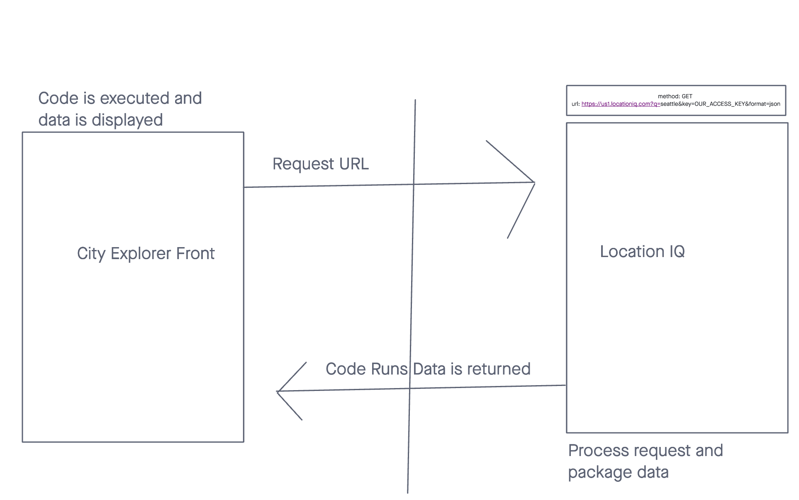
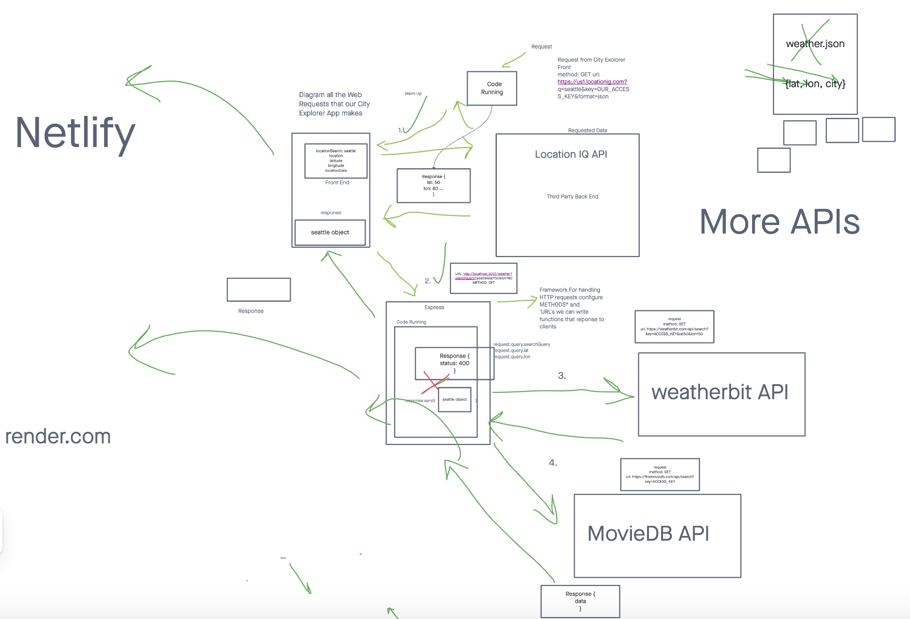
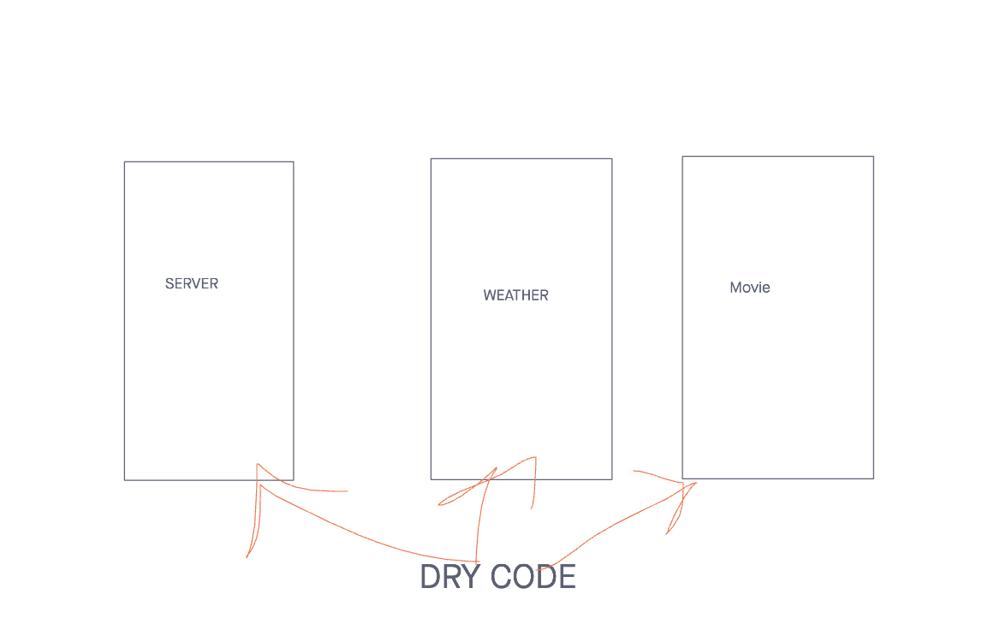
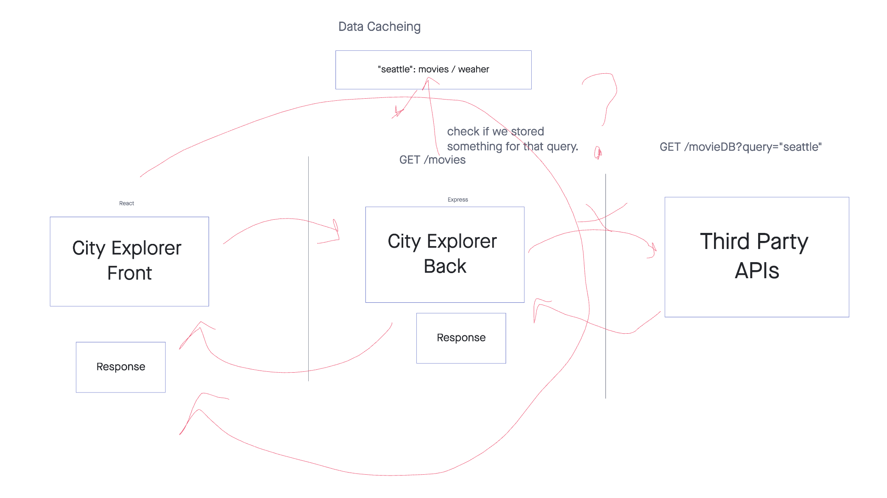

# city-explorer-api

# Lab7

**Author**: Sharmarke Nur
**Version**: 1.0.0 (increment the patch/fix version number if you make more commits past your first submission)

## Overview
<!-- Provide a high level overview of what this application is and why you are building it, beyond the fact that it's an assignment for this class. (i.e. What's your problem domain?) -->

## Getting Started
<!-- What are the steps that a user must take in order to build this app on their own machine and get it running? -->

## Architecture
<!-- Provide a detailed description of the application design. What technologies (languages, libraries, etc) you're using, and any other relevant design information. -->

## Change Log
<!-- Use this area to document the iterative changes made to your application as each feature is successfully implemented. Use time stamps. Here's an example:

01-01-2001 4:59pm - Application now has a fully-functional express server, with a GET route for the location resource. -->

## Credit and Collaborations
<!-- Give credit (and a link) to other people or resources that helped you build this application. -->

Name of feature: 1. Set up your server repository

Estimate of time needed to complete: 20 minutes

Start time: 2:20

Finish time: 2:35

Actual time needed to complete: 15 minutes

Name of feature: 2. Weather 

Estimate of time needed to complete: 2 hour

Start time: 2:40

Finish time: 9:30

Actual time needed to complete:  6 hours 50 minutes

## Lab 8

Name of feature: 1. Weather (live)

Estimate of time needed to complete: 1 hour

Start time: 5:20

Finish time: 5:55

Actual time needed to complete: 35 minutes

Name of feature: 2. Movies

Estimate of time needed to complete: 6:00

Start time: 1 hour

Finish time: 

Actual time needed to complete: 

# Lab 9 :

Collaborators: Adrian, Ash, Deiosha, Robert.

Name of feature: 1: Performance:

Estimate of time needed to complete: 1 hour

Start time: Performance: 1:00

Finish time: 3:30

Actual time needed to complete:  2 hours 30 minutes

Name of feature: 2. Refactor

Estimate of time needed to complete: 2 hours

Start time: 4:00

Finish time: 7:00

Actual time needed to complete: 3 hours

# Lab 10

Name of feature: 1: Performance

Estimate of time needed to complete: 2 hours

Start time: 4:00

Finish time: 7:00

Actual time needed to complete: 3 hours
